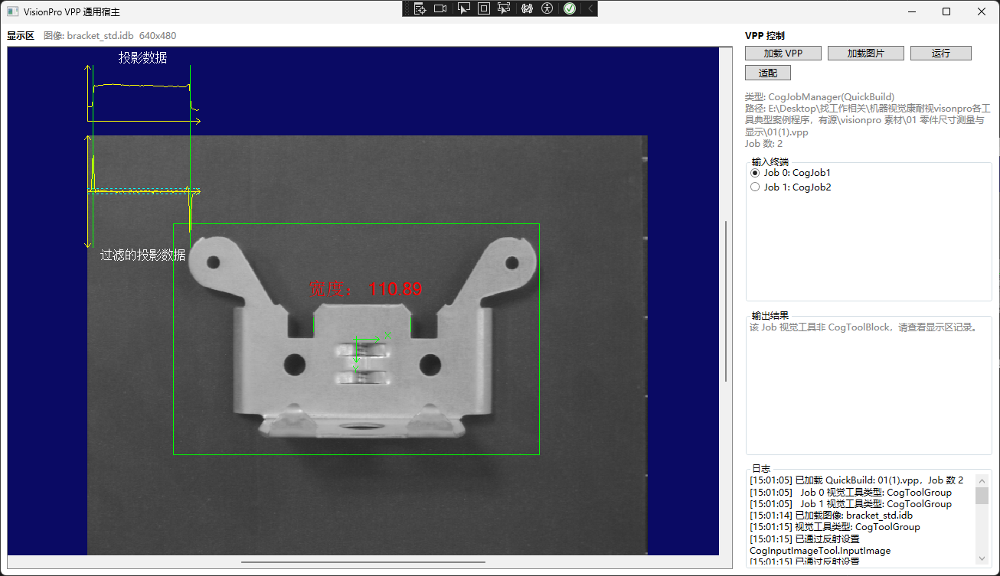
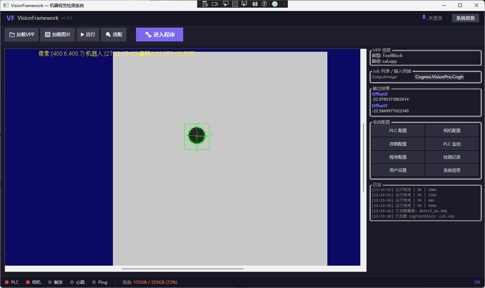

# VisionFramework

基于 **五层架构** 的 WPF + VisionPro 机器视觉框架，参考 [MachineVision](https://github.com/HenJigg/MachineVision) 和 [OpenIVS](https://github.com/dl-cv/OpenIVS) 两个开源项目的设计优势，形成可扩展、易维护的视觉系统基础框架。

## 效果展示





## 功能特性

- **五层架构**：Core / Devices / VisionPro / System / UI / App 分层解耦，接口驱动
- **多算法支持**：自动识别 CogToolBlock / QuickBuild 类型并枚举输入输出终端
- **PLC 联机控制**：触发信号自动检测、结果回写、程序号切换、心跳与 Ping 监测
- **状态指示灯**：PLC / 相机 / 触发 / 心跳 / Ping 实时状态，触发与心跳闪烁提示
- **检测记录存储**：每次检测自动保存到本地 SQLite（`data/records.db`），支持历史查询与 OK/NG 统计
- **离线调试**：文件虚拟相机，无需真实硬件即可调试视觉算法

## 架构设计

```
┌─────────────────────────────────────────────────────┐
│                    App 层 (启动入口)                  │
│              MainViewModel / MainWindow              │
├─────────────────────────────────────────────────────┤
│                    UI 层 (界面)                       │
│         VisionDisplayControl / MVVM 基础             │
├─────────────────────────────────────────────────────┤
│               System 层 (运行时调度)                   │
│     VisionOrchestrator / StateMachine / Buffer       │
├──────────────┬──────────────┬───────────────────────┤
│  Devices 层   │  VisionPro 层 │                       │
│  (设备实现)    │  (算法适配)    │   Core 层 (接口定义)   │
│  Camera/PLC   │  ToolBlock    │   ICamera/IAlgorithm  │
│               │  QuickBuild   │   IPlc/IOrchestrator  │
└──────────────┴──────────────┴───────────────────────┘
```

### 五层职责

| 层级 | 项目 | 职责 | 输出 |
|------|------|------|------|
| **Core** | `VisionFramework.Core` | 接口定义、数据模型、状态枚举 | DLL |
| **Devices** | `VisionFramework.Devices` | 相机/PLC 设备具体实现 | DLL |
| **VisionPro** | `VisionFramework.VisionPro` | VisionPro 算法适配、图像转换 | DLL |
| **System** | `VisionFramework.System` | 状态机、调度器、图像缓冲队列 | DLL (Runtime) |
| **UI** | `VisionFramework.UI` | WPF 显示控件、MVVM 基础设施 | DLL |
| **App** | `VisionFramework.App` | 应用入口、主窗口、依赖组装 | EXE |

> **注意**：System 层的项目目录仍为 `VisionFramework.System`，但程序集名和命名空间已改为 `VisionFramework.Runtime`，以避免与 .NET 的 `System` 命名空间冲突。

## 项目结构

```
VisionFramework.sln
├── src/
│   ├── VisionFramework.Core/              # 核心层：接口与数据模型
│   │   ├── Devices/
│   │   │   ├── ICamera.cs                 #   相机抽象接口
│   │   │   └── IPlcCommunicator.cs        #   PLC 通信抽象接口
│   │   ├── Algorithms/
│   │   │   ├── IVisionAlgorithm.cs        #   算法插件接口 + TerminalInfo
│   │   │   └── DetectionResult.cs         #   统一检测结果模型
│   │   ├── Runtime/
│   │   │   ├── IVisionOrchestrator.cs     #   调度器接口
│   │   │   └── VisionState.cs             #   状态枚举 + 事件参数
│   │   └── Data/
│   │       ├── IConfigProvider.cs         #   配置提供接口
│   │       ├── IResultStorage.cs          #   结果存储接口
│   │       └── DetectionRecordService.cs  #   SQLite 检测记录存储
│   │
│   ├── VisionFramework.Devices/           # 设备层：硬件实现
│   │   ├── Cameras/
│   │   │   ├── FileCamera.cs              #   文件虚拟相机（离线调试）
│   │   │   └── HikCamera.cs               #   海康相机（SDK 占位）
│   │   └── Plc/
│   │       └── HslPlcCommunicator.cs      #   HslCommunication PLC
│   │
│   ├── VisionFramework.VisionPro/         # 算法层：VisionPro 适配
│   │   ├── AlgorithmFactory.cs            #   工厂模式创建算法实例
│   │   ├── ToolBlockAlgorithm.cs          #   CogToolBlock 适配器
│   │   ├── QuickBuildAlgorithm.cs         #   CogJobManager 适配器
│   │   └── CogImageHelper.cs             #   图像转换（idb/bmp → ICogImage）
│   │
│   ├── VisionFramework.System/            # 系统层：运行时调度
│   │   ├── VisionStateMachine.cs          #   状态机（防止异常操作）
│   │   ├── VisionOrchestrator.cs          #   调度器（协调设备+算法+PLC）
│   │   └── ImageBufferQueue.cs            #   生产者-消费者图像队列
│   │
│   ├── VisionFramework.UI/                # 界面层：WPF 控件
│   │   ├── Controls/
│   │   │   ├── VisionDisplayControl.xaml  #   双显示区（图像+记录）
│   │   │   └── VisionDisplayControl.xaml.cs
│   │   ├── Views/
│   │   │   └── RecordHistoryWindow.xaml   #   检测记录查看窗口
│   │   └── ViewModels/
│   │       ├── ViewModelBase.cs           #   INotifyPropertyChanged 基类
│   │       └── RelayCommand.cs            #   ICommand 实现
│   │
│   └── VisionFramework.App/               # 应用层：入口
│       ├── App.xaml / App.xaml.cs
│       ├── MainWindow.xaml                #   主窗口布局
│       ├── MainWindow.xaml.cs
│       └── ViewModels/
│           └── MainViewModel.cs           #   主视图模型
│
└── images/
    └── screenshot-run.png                 #   运行效果截图
```

## 借鉴的开源项目

### 从 MachineVision 借鉴

| 设计点 | 说明 |
|--------|------|
| **分层架构** | 设备/算法/界面严格分离，通过接口通信 |
| **设备抽象** | `ICamera` 统一海康/文件/大华相机，切换设备不改上层代码 |
| **策略模式** | `IVisionAlgorithm` 接口 + `AlgorithmFactory` 工厂，按 VPP 类型自动选择算法实现 |
| **统一结果模型** | `DetectionResult` 封装所有检测结果（OK/NG、输出值、耗时、记录） |

### 从 OpenIVS 借鉴

| 设计点 | 说明 |
|--------|------|
| **状态机** | `VisionStateMachine` 管理运行流程，防止处理中重复触发等异常操作 |
| **图像缓冲队列** | `ImageBufferQueue<T>` 生产者-消费者模式，采集线程入队、处理线程出队，互不阻塞 |
| **离线调试模式** | `FileCamera` 从磁盘加载图像模拟采集，无需连接真实相机即可调试算法 |
| **回调式调度** | `IVisionOrchestrator` 调度器接口，改为 C# 事件驱动（比原版回调更符合 C# 惯例） |

## 核心接口

### ICamera — 相机抽象

```csharp
public interface ICamera : IDisposable
{
    string Name { get; }
    bool IsConnected { get; }
    event EventHandler<ImageCapturedEventArgs> ImageCaptured;
    event EventHandler<DeviceErrorEventArgs> ErrorOccurred;

    bool Connect();
    bool Connect(string connectionString);
    void Disconnect();
    void StartGrab();
    void StopGrab();
    void TriggerOnce();
}
```

### IVisionAlgorithm — 算法插件

```csharp
public interface IVisionAlgorithm : IDisposable
{
    string Name { get; }
    AlgorithmKind Kind { get; }
    bool IsInitialized { get; }

    void Initialize(string vppPath);
    DetectionResult Detect(object image);
    DetectionResult Detect(object image, Dictionary<string, object> inputs);

    List<TerminalInfo> GetInputTerminals();
    List<TerminalInfo> GetOutputTerminals();
    object GetLastRunRecord();
}
```

### IPlcCommunicator — PLC 通信

```csharp
public interface IPlcCommunicator : IDisposable
{
    bool IsConnected { get; }
    event EventHandler Disconnected;
    event EventHandler<DeviceErrorEventArgs> ErrorOccurred;

    bool Connect(string ipAddress, int port = 0);
    void Disconnect();

    bool ReadBool(string address);
    short ReadShort(string address);
    int ReadInt(string address);
    float ReadFloat(string address);
    string ReadString(string address, ushort length);

    void Write(string address, bool value);
    void Write(string address, short value);
    void Write(string address, int value);
    void Write(string address, float value);
    void Write(string address, string value);
}
```

### 状态机流程

```
         触发               采集完成           处理完成
Idle ──────────→ Grabbing ──────────→ Processing ──────────→ Outputting
 ↑                                                          │
 └──────────────────── 完成 ←──────────────────────────────┘

         任意状态                    任意状态
           │                           │
           ▼                           ▼
        Error ←──异常        Stopped ←──用户停止
           │                           │
           └──ResetError──→ Idle       └──Start──→ Idle
```

## 快速开始

### 环境要求

- **.NET Framework 4.8** SDK
- **Visual Studio 2022**（推荐）或 `dotnet CLI`
- **Cognex VisionPro** 安装在 `C:\Program Files (x86)\Cognex\VisionPro`
- 编译平台：**x86**（VisionPro 为 32 位）

### 编译

```bash
# 使用 dotnet CLI
dotnet build VisionFramework.sln -c Debug -p:Platform=x86

# 或使用 MSBuild
msbuild VisionFramework.sln /p:Configuration=Debug /p:Platform=x86
```

### 运行

**方式一：Visual Studio**

1. 打开 `VisionFramework.sln`
2. 右键 `VisionFramework.App` → **设为启动项目**
3. 按 `F5` 运行

> 注意：不能直接运行类库项目（Core/Devices/VisionPro/System/UI），必须将 `VisionFramework.App` 设为启动项目。

**方式二：直接运行 exe**

```
src\VisionFramework.App\bin\x86\Debug\net48\VisionFramework.exe
```

### 使用流程

**手动调试**

1. 点击 **「加载 VPP」** 选择 `.vpp` 文件
2. 程序自动识别类型（ToolBlock / QuickBuild）并枚举输入输出终端
3. 点击 **「加载图片」** 选择测试图像（`.idb` / `.bmp` / `.jpg`）
4. 点击 **「运行」** 执行视觉任务
5. 查看输出结果和叠加图形显示
6. 点击 **「适配」** 自适应缩放显示区

**PLC 联机模式**

1. 在 **「PLC 配置」** 中设置 IP/端口、触发地址、结果地址、心跳地址、程序号地址等
2. 连接 PLC 后，状态栏显示 PLC / 心跳 / Ping 指示灯状态
3. PLC 发送触发信号时，**「触发」** 指示灯闪烁，软件自动执行检测并回写 OK/NG 结果
4. PLC 程序号变化时自动切换对应的 VPP 程序

**检测记录**

1. 每次检测完成后自动保存到本地 SQLite 数据库（`data/records.db`）
2. 点击 **「检测记录」** 打开记录窗口，查看时间 / 产品 / VPP / 结果 / 耗时 / 输出值
3. 顶部显示总记录数与 OK / NG 统计，支持刷新

## 扩展指南

### 添加新相机

```csharp
using VisionFramework.Core.Devices;

public class DahuaCamera : ICamera
{
    public string Name => "DahuaCamera";
    public bool IsConnected { get; private set; }
    public event EventHandler<ImageCapturedEventArgs> ImageCaptured;
    public event EventHandler<DeviceErrorEventArgs> ErrorOccurred;

    public bool Connect(string connectionString)
    {
        // 实现大华 SDK 连接逻辑
        IsConnected = true;
        return true;
    }

    public void TriggerOnce()
    {
        // 触发采集，返回文件路径或图像对象
        ImageCaptured?.Invoke(this, new ImageCapturedEventArgs(imagePath));
    }

    // ... 其他接口成员
}
```

### 添加新算法

```csharp
using VisionFramework.Core.Algorithms;

public class OpenCVAlgorithm : IVisionAlgorithm
{
    public string Name => "OpenCV-Match";
    public AlgorithmKind Kind => AlgorithmKind.Unknown;

    public void Initialize(string configPath)
    {
        // 加载模板或模型
    }

    public DetectionResult Detect(object image, Dictionary<string, object> inputs)
    {
        // 执行检测，返回统一结果
        return DetectionResult.Success(new Dictionary<string, object>
        {
            ["score"] = 0.95
        });
    }

    // ... 其他接口成员
}
```

### 添加新 PLC 协议

```csharp
using VisionFramework.Core.Devices;

public class ModbusPlcCommunicator : IPlcCommunicator
{
    public bool Connect(string ipAddress, int port)
    {
        // 实现 Modbus TCP 连接
        return true;
    }

    public bool ReadBool(string address) { /* ... */ }
    public void Write(string address, bool value) { /* ... */ }

    // ... 其他接口成员
}
```

## 设计模式

| 模式 | 应用位置 | 说明 |
|------|----------|------|
| **工厂模式** | `AlgorithmFactory` | 根据 VPP 文件类型创建对应算法实例 |
| **策略模式** | `IVisionAlgorithm` | 算法实现可替换，上层代码不感知 |
| **状态机** | `VisionStateMachine` | 管理运行流程状态转换 |
| **生产者-消费者** | `ImageBufferQueue<T>` | 采集和处理线程解耦 |
| **观察者** | 事件驱动 | `ImageCaptured`、`StateChanged`、`DetectionComplete` |
| **外观模式** | `VisionOrchestrator` | 统一协调相机、算法、PLC |
| **MVVM** | `ViewModelBase` + `RelayCommand` | WPF 数据绑定与命令绑定 |

## 技术栈

| 技术 | 用途 |
|------|------|
| WPF + MVVM | 界面层 |
| .NET Framework 4.8 | 运行时 |
| Cognex VisionPro | 视觉算法 |
| HslCommunication | PLC 通信（西门子/三菱/欧姆龙等） |
| 海康相机 SDK | 图像采集 |
| SQLite (System.Data.SQLite) | 检测记录本地存储 |

## License

MIT
